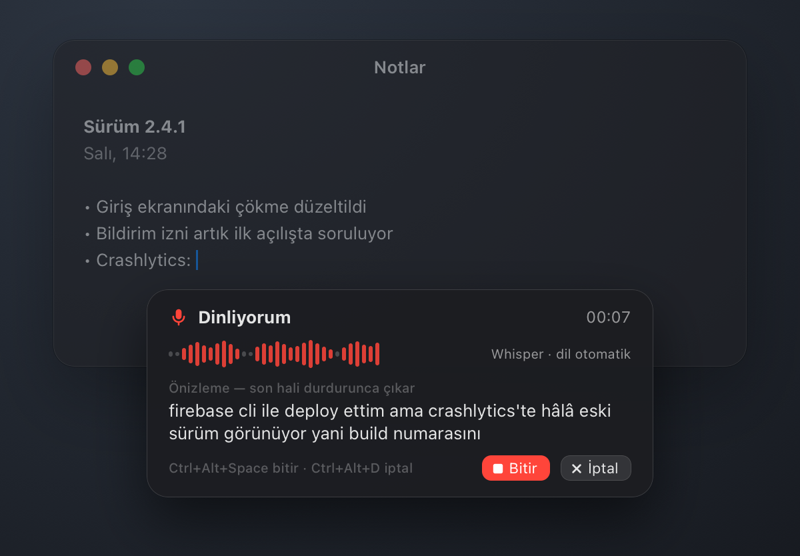
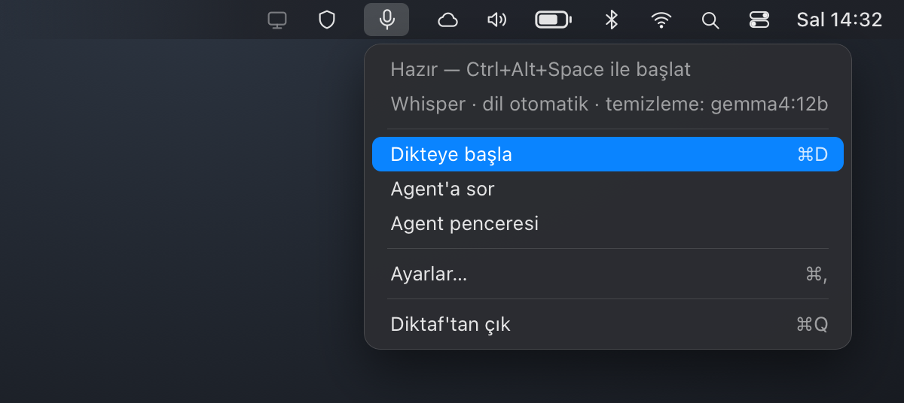
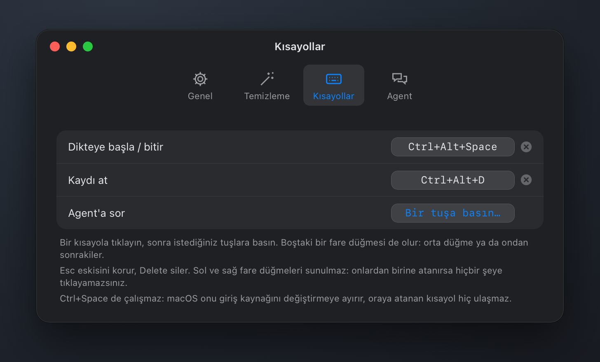
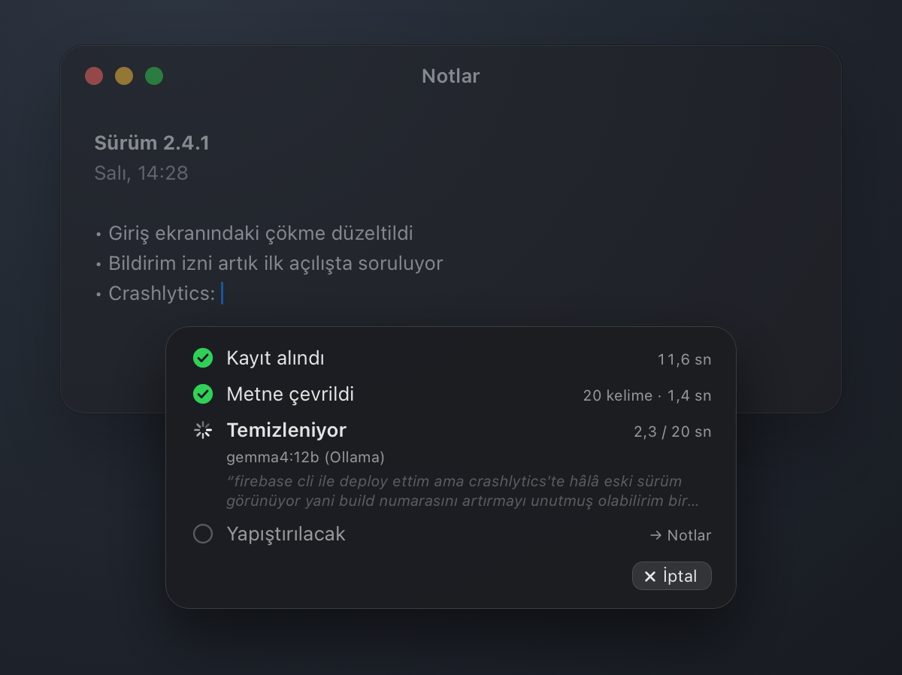
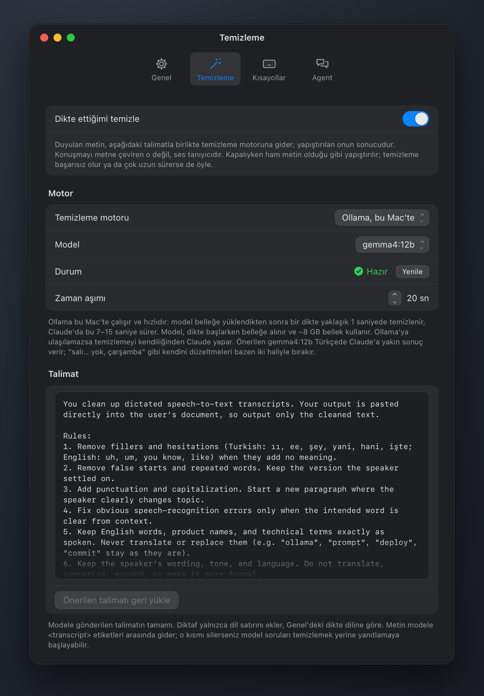
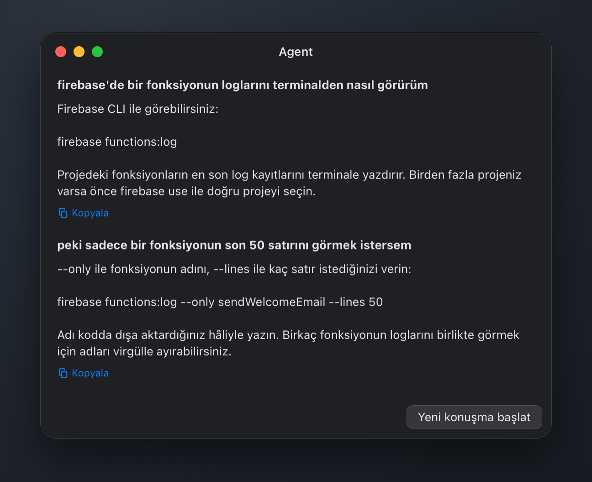
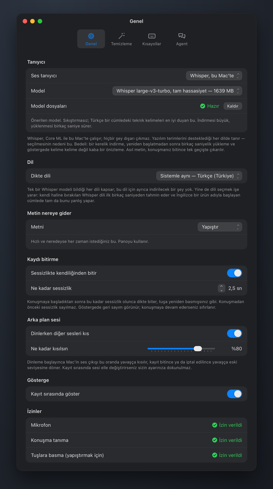

# Diktaf

Press a key, talk, press it again. A recogniser on this Mac turns the recording
into text, a local model cleans it up by a prompt you wrote, and the result
lands in your clipboard and is pasted into whatever window you were typing in.



No API keys, and nothing leaves the machine. Two recognisers to choose between,
both running here: Apple's own, which needs no download, and Whisper
large-v3-turbo, whose weights you fetch once from Settings. Cleanup runs through
[Ollama](https://ollama.com) on this Mac (`gemma4:12b` unless you pick
another), or the `claude` CLI you are already signed in to.

```sh
Scripts/install.sh      # builds Diktaf.app, installs it, starts it at login
```

| What | How |
| --- | --- |
| Start / stop dictating | `Ctrl+Alt+Space`, or the menu bar icon |
| Throw the recording away | `Ctrl+Alt+D` |
| Ask the agent instead of pasting | `Ctrl+Alt+A` |

`Ctrl+Space` is not among them: on macOS that key belongs to the input source
switcher and never reaches an application. Every combination is yours to change
in Settings.





## What it does

**Dictation.** The recogniser runs on this Mac either way. The indicator shows
the text arriving so you can see it is hearing you. Once you stop, it shows each
step — recorded, transcribed, cleaned up by which model against which deadline,
pasted where:



**Cleanup prompt.** One text field holds the whole prompt handed to the local
agent — *drop the filler words*, *keep my wording*, *no markdown*, and whatever
else you add. Diktaf adds only the dictation language to it. Cleanup can
be switched off, in which case the raw transcript is pasted. If the agent fails
or takes too long, the raw transcript is pasted anyway: a dictation that arrives
uncleaned beats one that disappears.



**Agent.** A dictation sent to the agent becomes a question rather than text to
paste. The reply is shown, and the conversation can be continued or cleared.



## Which recogniser

Settings → General → Recognise with. Neither is better at everything, so pick on
what you dictate.



**The macOS recogniser** is the model behind the system's own dictation. Nothing
to download, starts instantly, and words appear as you say them. Its weakness is
names it does not expect: dictate "the Firebase CLI" in a Turkish sentence and you
get three Turkish words that sound like it. The cleanup agent cannot rescue that
— the information is gone before it ever sees the text.

**Whisper** is large-v3-turbo, converted to Core ML and run on this Mac. It knows
the vocabulary of people who talk about software, in every language it supports,
which is the reason to use it. Choosing it shows a Download button and what the
download costs:

| Model | Download |
| --- | --- |
| Whisper large-v3-turbo, full precision (recommended) | 1639 MB |
| Whisper large-v3-turbo | 646 MB |
| Whisper small | 217 MB |

The weights land in `~/Library/Application Support/Diktaf/WhisperModels` and a
Remove button gives the space back. The cost besides the download is a couple of
seconds to load after a restart, and an indicator that shows a rough preview
rather than every word — Whisper reads a whole utterance at a time, so the real
transcript is made in one pass when you stop talking.

## Languages

Pick yours in Settings → General. The macOS recogniser has a model per language
and covers 54 of them — Turkish, Russian, Polish, Arabic, Hindi, the Nordic
languages and the rest; a ✓ beside a language means its model is already here, and
anything else offers a Download. One set of Whisper weights covers every language
it knows, so there is nothing further to fetch for that engine.

Naming the language is worth doing for Whisper too. Left to work it out, it
decides from the first few seconds and commits — and a sentence that opens with an
English product name is exactly what it gets wrong.

(macOS has a third recogniser, the one meant for transcribing recordings. It
covers 30 languages and has no Turkish. Diktaf does not use it, and
[ARCHITECTURE.md](ARCHITECTURE.md) says why in more detail.)

## Requirements

* macOS 26 or later. Diktaf uses the `SpeechAnalyzer` API introduced there, which
  is both the best on-device recogniser Apple ships and the reason there is no
  earlier fallback.
* Xcode 26 (or its command line tools) to build.
* [Ollama](https://ollama.com) with a model pulled (`ollama pull gemma4:12b`)
  for fast cleanup. Without it, cleanup falls back to Claude.
* The [`claude` CLI](https://claude.com/claude-code), signed in, for cleanup and
  the agent. Without it, dictation still works and pastes the raw transcript.

macOS will ask for the microphone and for speech recognition the first time you
dictate. Pasting needs one more that it cannot ask for: System Settings → Privacy
& Security → Accessibility → allow Diktaf. Until it has been allowed, Diktaf says
so in the menu bar — worth knowing, because told to press a key it has not been
allowed to, macOS reports that it did and the text arrives nowhere.

## Building and hacking on it

```sh
swift build                  # the package
swift test                   # the domain and the agent adapters, offline
Scripts/build-app.sh          # assembles build/Diktaf.app
Scripts/render-mockups.sh     # redraws the README pictures from docs/mockups
```

The layering is the point, and [ARCHITECTURE.md](ARCHITECTURE.md) is worth
reading before changing anything: `DiktafCore` holds the domain and imports
Foundation and nothing else, the platform lives behind protocols in
`DiktafCore/Ports`, and macOS is one set of adapters. Windows is not supported,
but it is a target away rather than a rewrite — which is the only reason the
seam exists.

The two recognisers are what that seam is for: `DiktafMac` and `DiktafWhisper`
both fill the `Transcriber` port, neither knows the other exists, and
`DiktafWhisper` is where the package's only external dependency stops.
